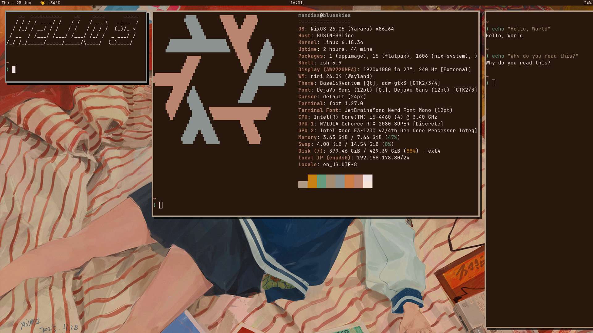

# Dotfiles

This repository contains **All of my Configuration Files** for various **Machines**, as well as **Operating Systems**, **Distributions**, **Desktop Environments**, **Window Tiling Managers** and **Tools**.

 The newest configuration files are made specifically for Linux Distribution called **NixOS**. This Linux Distribution utilizes functional domain-specific Language called Nix to manage OS configuration. Also, I've paired it with Features like **Flakes**, **Home-Manager**, etc. 

Those choises allowed me to have **better reproducibility**, and more options for setting up applications on **System** and on **Home Level**. With this I can setup everything including the OS, DE/WM and tools all in one root directory, which is this dotfiles repository, **rollback** and, or try other configuration files with a **single command**. 

## Trying the Configuration out
With help of the Configuration that was made utilizing Nix with other Features, you should find it **very straightforward** to try out the Configuration yourself if you are on **NixOS**. Just clone this repo to any directory of your choice, change into pc-laptop or server directory and run following command, where you can choose between **blueskies**_(my PC)_ and **redpanda**_(my Laptop)_: `sudo nixos-rebuild switch --flake #.blueskies`

## Directories - Walkthrough 

- **pc-laptop** - intended for Configuration Files of my "general" systems (e.g. pc/laptop). Here you can find Configuration Files for various Distributions (e.g. NixOS, Gentoo's compiler, Window Tiling Manager configs, cli tools configurations, ...)
- **server** - stores Configuration Files for my Server Machines. These can be Container setup data Files (e.g. podman, docker, ...), or it can also be Generic Configuration of the system. I currently run NixOS on my server. You will be able to find Configuration Files for it too.
- **old-dotfiles** - stores all of my older configuration files for different systems and different Linux Distributions, as well as tools. In the near future, this directory will probably be deleted.

### Notes

Inside Directories you will find Configuration Files. Sometimes I will also include Images for better visualization, and README.md files, where short information about how it functions and what it does will be contained.

---

*Smiley face to cheer you up :)*
